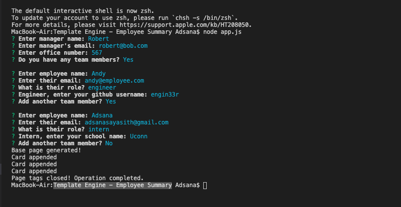
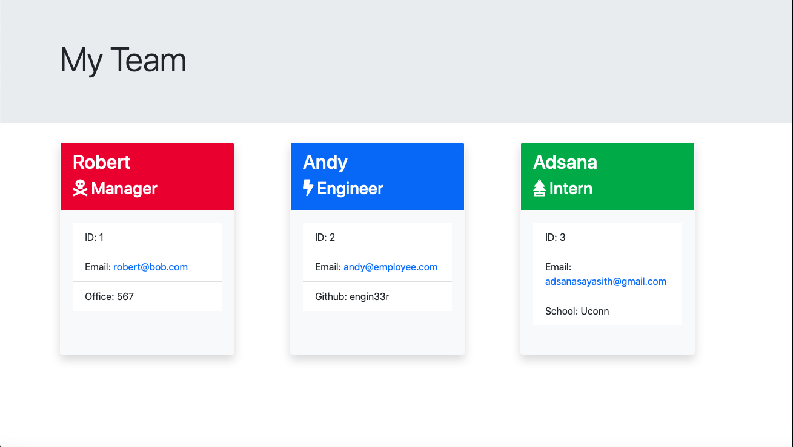
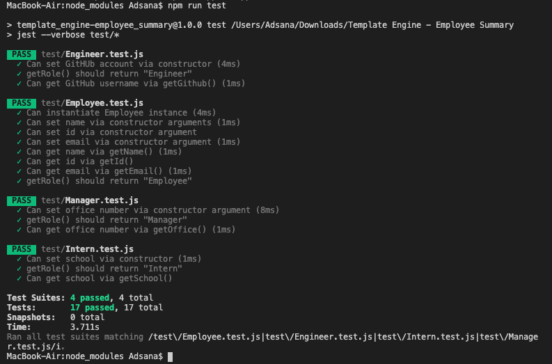

## Description

This is a node CLI. A software engineering team generator command line application. The application will prompt the user for information about the team manager and then information about the team members. The user can input any number of team members, and they may be a mix of engineers and interns. When the user has completed building the team, the application will create an HTML file that displays a nicely formatted team roster based on the information provided by the user.

## Intructions

After downloading the repo, in your terminal change your directory to the folder where the repo resides and run the following commands;
1) npm install
2) npm install inquirer
3) npm install jest

To run the program type "node app.js"

An example of the html output

To run tests type "npm run test"

